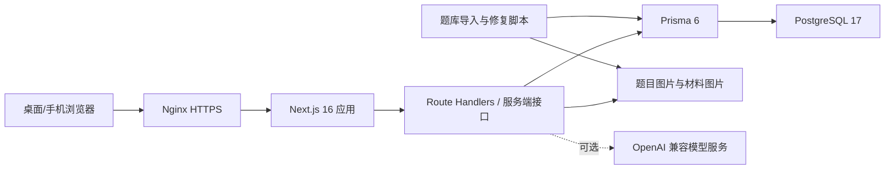

# 知政公考项目说明文档

> 文档基线：2026-07-19，线上版本 `20260719-practice-swap-button-r9`。
>
> 本文用于说明项目定位、功能范围、技术架构、数据模型、开发方式、测试策略和部署流程，不包含任何生产密钥或数据库密码。

## 1. 项目概述

知政公考是一套面向公务员考试备考场景的全栈学习系统，覆盖行测专项练习、模拟考试、申论训练、错题复习、收藏、学习分析、每日任务和一周阶段规划。

系统以真实题库、逐题作答记录和用户设置为基础，生成可执行的训练任务，并通过系统验收或用户自验收形成学习闭环。模型服务为可选增强项；未配置模型或模型不可用时，系统会自动使用规则规划和规则评价，不影响核心学习流程。

当前线上信息：

| 项目 | 当前状态 |
| --- | --- |
| 公网地址 | `https://8.163.38.217` |
| 当前发布编号 | `20260719-practice-swap-button-r9` |
| 当前 Web 镜像 | `sha256:2a9ec0aa419f91a693284271d74735e66e64a698126dd65c530ef93d7a49763c` |
| 题库规模 | 50,402 道 |
| Web 容器 | `healthy` |
| PostgreSQL 容器 | `healthy` |
| 健康检查 | `GET /api/health` |

## 2. 用户与权限

系统包含学员和管理员两类角色。

| 角色 | 权限范围 |
| --- | --- |
| 学员 `STUDENT` | 注册、登录、训练、考试、申论、规划、打卡、错题、收藏和学习分析 |
| 管理员 `ADMIN` | 题库管理、账号管理、模型配置和运营维护 |

公开注册接口固定创建 `STUDENT`，客户端提交管理员角色不会获得提权。管理员账号应通过受控种子数据或后台运维流程创建。

## 3. 核心功能

### 3.1 账号与会话

- 邮箱注册、登录、退出和会话恢复。
- 密码使用 `bcryptjs` 哈希后存储。
- 会话使用 `jose` 签发并写入 HttpOnly Cookie。
- 正式 HTTPS 环境支持 Secure Cookie。
- 删除账号时级联清理相关学习数据。

### 3.2 学习首页

- 展示累计答题量、正确率、本周完成量和连续学习情况。
- 展示板块能力、近期趋势和今日学习目标。
- 汇总专项、模考、申论、错题和规划产生的真实学习数据。

### 3.3 专项练习

- 支持按大板块和多个细分板块组合选题。
- 支持基础、进阶、困难、推荐难度和自定义难度区间。
- 支持自定义题量并实时显示当前条件下的可用题数。
- 服务端随机组题，并过滤近期题目和重复题干。
- 资料分析按完整材料五题组抽取，不拆散材料。
- 支持正计时、暂停、恢复、刷新恢复和逐题用时记录。
- 作答后不会立即展示答案，交卷结算页统一展示逐题答案和解析。
- 交卷前可返回并修改前面题目的答案，同一会话不会重复累计 Attempt。
- 桌面材料题采用材料与题目左右分栏，手机端采用可展开的底部题板。
- 宽屏下将练习进度、计时、暂停、题号、交卷和换题工具固定在最右侧，可收起为 52px 工具栏。
- “换一组题目”支持作答保存期间排队，显示“保存后换题”和“正在换题”，错误直接显示在右侧工具栏内。

### 3.4 模拟考试

- 支持国考型和省考型固定卷面模板。
- 按正式板块配额和细分题型规则组卷。
- 使用正计时，不使用倒计时。
- 支持暂停、继续、逐题导航和答案自动保存。
- 刷新或重新登录后可恢复未交卷考试。
- 服务端截止后拒绝新增答案。
- 交卷后生成成绩、板块统计和逐题解析。

### 3.5 申论训练

- 提供申论材料、题目、字数限制和在线作答。
- 服务端统计字数并生成评分与反馈。
- 支持计划任务证据绑定和系统验收。
- 当前基础数据包含 3 套申论材料和 6 道申论题。

### 3.6 每日任务

- 只规划当前一天，不一次细化未来七天的逐日任务。
- 依据一周阶段目标、近期作答、错题、用时和用户设置滚动生成。
- 一天任务完成后累计一次完成次数，并自动生成下一天计划。
- 支持每日任务数量范围，而不是单一“最多任务数”。
- 支持可选的均衡分配约束，减少不同日期任务量过度波动。
- 支持单任务最大题量，不设置单任务时间上限。
- 支持系统验收和自验收两种方式。
- 系统验收使用绑定的专项、模考、申论或训练报告作为证据。
- 计划练习可在保持任务细分板块、题量和难度约束的前提下更换题组。

### 3.7 一周规划

- 只定义未来一周要达成的阶段目标，不规定每一天的具体任务。
- 包含核心目标、达成标准、资源分配、训练节奏和动态调整规则。
- 可配置每周模拟考试次数。
- 每日任务依据一周目标继续细化并执行。

### 3.8 错题、收藏与学习分析

- 错题按训练批次和板块归档。
- 收藏支持添加、取消和跨登录同步。
- 学习分析展示累计表现、板块能力、七天趋势和逐题用时。
- 难度、正确率和时间要求会结合真实作答数据持续校准。

### 3.9 管理后台

- 题目搜索、分页和状态筛选。
- 新增、编辑、发布和停用题目。
- 账号查询、筛选和删除。
- 管理员自删保护与角色校验。
- OpenAI 兼容模型配置管理，API Key 不向客户端回显。

## 4. 系统架构



系统采用单体全栈结构：

- 前端页面、交互组件和服务端接口位于同一 Next.js 应用。
- Prisma 负责数据访问和正式迁移。
- PostgreSQL 保存账号、题库、会话、作答、报告和规划数据。
- 题目图片与材料图片使用宿主机持久化目录挂载到容器。
- 模型服务是可选外部依赖，规则逻辑始终作为降级路径存在。

## 5. 技术栈

| 分类 | 技术 |
| --- | --- |
| Web 框架 | Next.js 16.2 |
| UI 运行时 | React 19.2 |
| 开发语言 | TypeScript |
| 样式 | Tailwind CSS 4 + 全局响应式 CSS |
| 图标 | Lucide React |
| 图表 | Recharts |
| ORM | Prisma 6.19 |
| 数据库 | PostgreSQL 17 |
| 输入校验 | Zod 4 |
| 身份会话 | jose + HttpOnly Cookie |
| 密码哈希 | bcryptjs |
| 测试 | Node.js Test Runner + Playwright Core + Microsoft Edge |
| 部署 | Docker、Docker Compose、Nginx |
| 模型增强 | OpenAI Responses / Chat Completions 兼容接口 |

## 6. 关键业务流程

### 6.1 专项练习流程

1. 客户端读取分类、训练偏好和进行中的会话。
2. 服务端按细分板块、难度、题量和近期历史筛选题目。
3. 创建 `PracticeSession` 并保存题目顺序和配置快照。
4. 每次作答由服务端判定并写入 `Attempt`。
5. 暂停时锁定作答并累计暂停时长。
6. 交卷时生成 `TrainingReport`。
7. 报告进入模型评价；模型不可用时使用规则评价。
8. 若练习来自每日任务，报告可作为系统验收证据。

### 6.2 每日任务流程

1. 读取有效的一周阶段规划。
2. 汇总近期正确率、难度、用时、错题和已完成任务。
3. 按用户设置生成当前一天任务。
4. 用户启动专项、模考或申论任务。
5. 系统保存训练证据并执行系统验收，或由用户自验收。
6. 当日全部任务完成后累计完成次数并滚动生成下一天。

### 6.3 模型降级流程

1. 检查模型配置、请求额度和目标 URL 安全性。
2. 在总超时内调用 Responses 或 Chat Completions 接口。
3. 校验模型返回的 JSON 结构。
4. 对题量、难度、时间、验收方式等字段执行服务端约束。
5. 请求失败、超时、额度耗尽或结构非法时回退到规则结果。

## 7. 数据模型

主要数据表如下：

| 模型 | 用途 |
| --- | --- |
| `User` | 账号、角色和目标考试 |
| `Category` | 行测大板块 |
| `Question` | 题干、选项、答案、解析、难度和来源 |
| `QuestionMaterial` | 资料分析公共材料、结构化块和图片 |
| `Attempt` | 逐题作答、正确性、模式和用时 |
| `Favorite` | 用户收藏 |
| `PracticeSession` | 专项会话、题目顺序、答案和暂停状态 |
| `ExamSession` | 模考会话、答案、时长和恢复状态 |
| `TrainingPreference` | 专项与模考个性配置 |
| `TrainingReport` | 训练总结、板块表现和模型评价 |
| `StudyPlan` | 当前一天任务、策略和生成快照 |
| `WeeklyStudyPlan` | 一周阶段目标与资源分配 |
| `StudyPlanCheckIn` | 任务打卡和验收快照 |
| `StudyPlanEvidenceClaim` | 系统验收证据的唯一占用记录 |
| `EssayMaterial` / `EssayQuestion` | 申论材料与题目 |
| `EssaySubmission` | 申论作答与评分反馈 |
| `ModelConfig` | 加密保存的全局模型配置 |
| `ModelUsageDaily` | 用户级和全站模型请求额度 |

## 8. 题库与难度体系

### 8.1 题库来源与去重

- 支持多个公开题库来源导入。
- 使用来源试卷与题目编号形成稳定外部键。
- 导入、组题和近期历史三个层面均执行去重。
- 题干规范化后再次过滤文本重复题。
- 资料分析只接受完整五题材料组。

### 8.2 图片和材料

- 材料图片位于 `public/question-materials`。
- 题干、选项和公式图片位于 `public/question-images`。
- 图片导入脚本支持本地化、缺图审计、修复和异常隔离。
- 材料表格支持横向滚动，图片支持放大查看。

### 8.3 逐题难度

- 难度使用 1 至 10 分制，不按板块或整套材料统一赋值。
- 常识与政治理论结合知识点数量、生僻度、精确记忆要求和真实错误率。
- 资料分析按直接读数、增长率、增长量、基期、比重、平均数和复合计算逐题区分。
- 其他板块结合题面结构、推理步骤、干扰项和真实错误率校准。
- 当前全题库已执行逐题难度重算。

### 8.4 动态时间要求

- 不同细分板块使用不同的初始题均时间。
- 数量关系和资料分析使用更宽松的时间余量。
- 随有效作答样本增加，系统逐步学习用户真实题均用时。
- 异常极端用时会被抑制，避免少量样本导致要求剧烈波动。

## 9. API 模块

主要接口目录位于 `src/app/api`：

| 路径 | 用途 |
| --- | --- |
| `/api/auth/*` | 注册、登录、退出和当前会话 |
| `/api/questions/*` | 题目分页、详情、组题、可用量和判题 |
| `/api/practice-sessions/*` | 专项会话创建、恢复、暂停和进度保存 |
| `/api/exam-sessions/*` | 模考会话创建、恢复、暂停和答案保存 |
| `/api/exams/submit` | 模考统一交卷 |
| `/api/training-preferences` | 个性训练配置 |
| `/api/training-reports/*` | 训练总结和模型评价 |
| `/api/study-plan/*` | 每日任务、推进、打卡和系统验收 |
| `/api/weekly-plan` | 一周阶段规划 |
| `/api/essays/*` | 申论题目与提交 |
| `/api/favorites/*` | 收藏管理 |
| `/api/wrong-questions` | 错题集 |
| `/api/statistics/overview` | 学习统计 |
| `/api/admin/*` | 管理员题库、账号和模型配置 |
| `/api/health` | 应用与数据库健康状态 |

所有写接口均在服务端执行身份、角色、输入结构和业务约束校验。接口错误使用统一 JSON 结构返回。

## 10. 项目目录

```text
.
├─ src/
│  ├─ app/
│  │  ├─ api/                  服务端 Route Handlers
│  │  ├─ admin/                管理后台页面
│  │  └─ globals.css           全局与响应式样式
│  ├─ components/app/          学员端、管理员端和业务组件
│  └─ lib/                     规划、难度、验收、会话和共享服务
├─ prisma/
│  ├─ schema.prisma            数据模型
│  ├─ migrations/              正式数据库迁移
│  └─ seed.ts                  基础种子数据
├─ scripts/                    题库导入、审计、修复和难度重算
├─ public/
│  ├─ question-materials/      材料图片持久化目录
│  └─ question-images/         题干与选项图片持久化目录
├─ tests/                      单元、接口与浏览器测试
├─ deploy/                     Nginx 配置和历史发布脚本
├─ android-app/                Android 客户端工程
├─ Dockerfile                  多阶段生产镜像
├─ docker-compose.yml          数据库、迁移、Web 和工具服务
└─ DEPLOYMENT.md               部署与发布记录
```

## 11. 本地开发

### 11.1 环境要求

- Node.js 24 或兼容版本。
- PostgreSQL 17 或兼容版本。
- npm。
- Windows 浏览器测试默认使用 Microsoft Edge。

### 11.2 初始化

```bash
npm install
npm run db:generate
npm run db:migrate
npm run db:seed
npm run dev
```

浏览器访问：

```text
http://localhost:3000
```

首次启动前应根据 `.env.example` 创建本地 `.env`，至少设置：

```text
DATABASE_URL=postgresql://用户名:密码@localhost:5432/gov_exam?schema=public
SESSION_SECRET=本地开发使用的高强度随机字符串
COOKIE_SECURE=0
```

### 11.3 演示账号

| 角色 | 邮箱 | 初始密码 |
| --- | --- | --- |
| 学员 | `student@zhizheng.local` | `Demo123456` |
| 管理员 | `admin@zhizheng.local` | `Demo123456` |

演示密码只用于本地种子环境，不应直接用于生产。

## 12. 常用命令

```bash
# 开发与构建
npm run dev
npm run build
npm start

# 代码检查与测试
npm run lint
npm run test:unit
npm run test:api
npm run test:ui
npm test

# 数据库
npm run db:generate
npm run db:migrate
npm run db:seed

# 题库导入
npm run db:import:public
npm run db:import:bala
npm run db:import:huatu

# 题库维护
npm run db:audit:questions
npm run db:fix:questions
npm run db:audit:missing-images
npm run db:repair:images
npm run db:repair:materials
npm run db:repair:missing-materials
npm run db:repair:missing-direct-images
npm run db:score:difficulty
```

## 13. 环境变量

| 变量 | 说明 |
| --- | --- |
| `DATABASE_URL` | Prisma PostgreSQL 连接串 |
| `POSTGRES_PASSWORD` | Compose 数据库容器密码 |
| `SESSION_SECRET` | 会话签名密钥，生产必须使用高强度随机值 |
| `MODEL_CONFIG_ENCRYPTION_KEY` | 模型 API Key 加密密钥 |
| `COOKIE_SECURE` | `0`、`1` 或 `auto` |
| `APP_BIND` | 应用绑定地址，生产推荐 `127.0.0.1` |
| `APP_PORT` | 应用端口，默认 `3000` |
| `APP_AUTO_SEED` | 空库首次启动是否自动写入种子 |
| `QUESTION_MATERIALS_PATH` | 材料图片宿主机目录 |
| `QUESTION_IMAGES_PATH` | 题目图片宿主机目录 |
| `OPENAI_API_KEY` | 可选模型密钥 |
| `OPENAI_MODEL` | 可选模型标识 |
| `OPENAI_BASE_URL` | OpenAI 兼容接口地址 |
| `MODEL_REQUEST_TIMEOUT_MS` | 模型请求总超时 |
| `MODEL_EVALUATION_DAILY_LIMIT` | 单用户每日评价请求上限 |
| `MODEL_EVALUATION_GLOBAL_DAILY_LIMIT` | 全站每日评价请求上限 |
| `ALLOW_PRIVATE_MODEL_BASE_URL` | 是否允许受信任的私网模型地址 |
| `HUATU_TARGET_PUBLISHED` | 华图来源目标正式题量 |
| `HUATU_REQUEST_CONCURRENCY` | 华图导入并发数 |
| `HUATU_REQUEST_INTERVAL_MS` | 华图请求间隔 |
| `NPM_REGISTRY` | Docker 构建使用的 npm registry |

生产环境文件 `.env.production` 不应提交到版本库或写入发布包。

## 14. 测试策略

项目采用分层测试：

| 测试层 | 覆盖内容 |
| --- | --- |
| ESLint | 代码规范和常见错误 |
| TypeScript / Build | 类型、服务端边界和生产构建 |
| 单元测试 | 难度、题型范围、材料解析、缺图修复、规划完成和计时 |
| API 集成测试 | 身份、题库、会话、判题、计划、验收、报告和管理员接口 |
| Playwright UI | 注册登录、专项、模考、申论、规划、移动端和材料题交互 |

完整验证命令：

```bash
npm test
```

高风险改动发布前还应执行对应的公网临时账号验收，并在完成后删除账号及关联数据。

## 15. 生产部署

生产环境使用 Docker Compose，包含：

| 服务 | 作用 |
| --- | --- |
| `database` | PostgreSQL 17 数据库 |
| `migrate` | 执行 Prisma 正式迁移 |
| `app` | 非 root Next.js standalone Web 容器 |
| `tools` | 题库导入、修复和难度批处理 |

基础启动命令：

```bash
docker compose --env-file .env.production up -d --build
```

推荐发布流程：

1. 本地完成 lint、类型检查、构建和相关测试。
2. 生成不包含环境文件、题库图片和数据库卷的发布包。
3. 上传后校验 SHA-256。
4. 备份代码和 PostgreSQL 数据库。
5. 在旧服务在线期间构建候选镜像。
6. 标记旧镜像为回滚点。
7. 短暂重建 Web 容器。
8. 核对镜像 ID、核心数据计数、容器健康和公网健康接口。
9. 使用临时账号执行真实业务验收并清理数据。

完整部署说明和每次发布记录见 [DEPLOYMENT.md](./DEPLOYMENT.md)。

## 16. 安全与运维

- 生产数据库端口不对公网开放。
- Web 容器默认只绑定 `127.0.0.1`，由 Nginx 提供 HTTPS。
- `SESSION_SECRET` 和数据库密码不得使用示例值。
- 模型 Base URL 默认拒绝本机、私网、链路本地和云元数据地址，降低 SSRF 风险。
- 模型请求拒绝重定向并受统一超时和日额度限制。
- API Key 不回显，配置入库时使用加密密钥保护。
- 应用和数据库均配置健康检查与日志轮转。
- PostgreSQL、材料图片和题目图片必须纳入异机备份。
- 小内存服务器应保留 Swap，并避免在运行镜像中一次性加载完整题库关系。

## 17. 当前约束与后续方向

当前仍建议继续完善：

- 邮箱验证、修改密码和找回密码。
- 正式域名与长期有效证书，替代直接 IP 入口。
- 将题目图片迁移到对象存储，支持多 Web 实例。
- 完整的试卷运营、申论材料管理和发布后台。
- 错题间隔复习与更精细的知识点标签。
- 邮件、消息或移动端推送的计划提醒。
- 更完整的监控告警、异机备份和灾难恢复演练。
- 在数据积累后继续校准细分板块难度、正确率和题均时间。

## 18. 相关文档

- [README](./README.md)
- [部署说明与发布记录](./DEPLOYMENT.md)
- [测试用例](./TEST_CASES.md)
- [验收报告](./ACCEPTANCE_REPORT.md)
- [题目与套题难度算法](./DIFFICULTY_ALGORITHM.md)
- [题库审计](./QUESTION_BANK_AUDIT.md)
- [迭代规划](./ITERATION_PLAN.md)
- [Luna 开发计划](./LUNA_DEVELOPMENT_PLAN.md)

